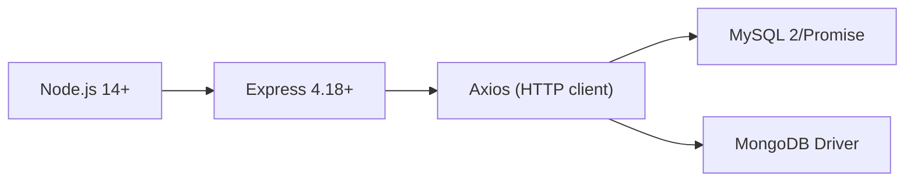
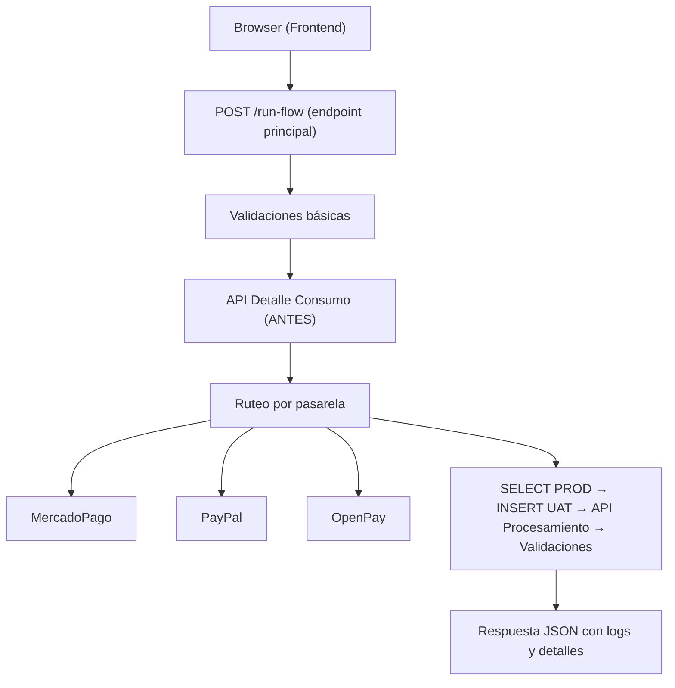
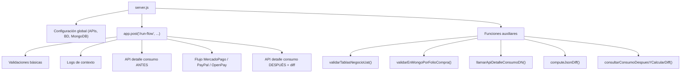
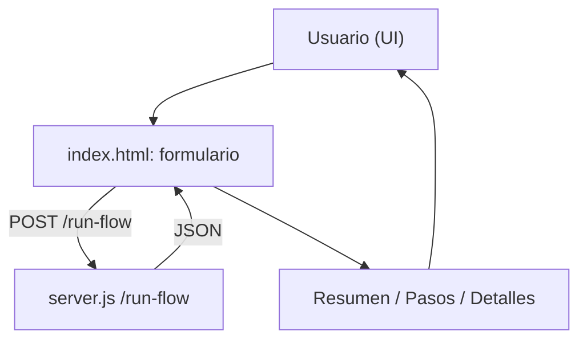
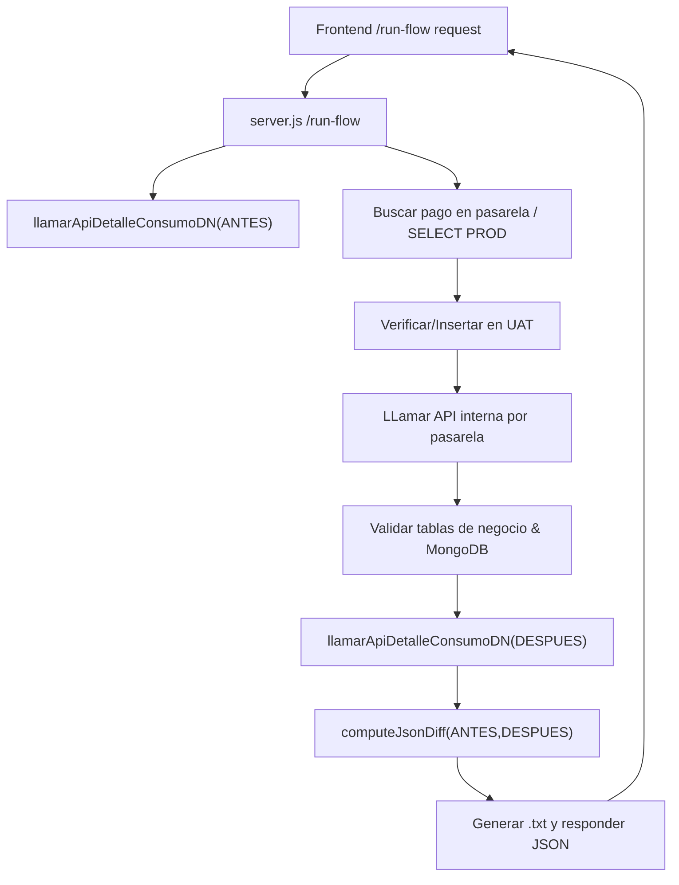

# Documentación Técnica - Simulador de Pagos QA

## Índice

1. [Descripción General](#descripción-general)
2. [Arquitectura](#arquitectura)
3. [Configuración](#configuración)
4. [API Endpoint](#api-endpoint)
5. [Flujos por Pasarela](#flujos-por-pasarela)
6. [Funciones Auxiliares](#funciones-auxiliares)
7. [Manejo de Errores](#manejo-de-errores)
8. [Debugging y Logs](#debugging-y-logs)

---

## Descripción General

Este servidor Node.js/Express es una herramienta de QA que simula el reproceso completo de notificaciones de pagos desde múltiples pasarelas en el ambiente UAT (pruebas).

### Funcionalidades Principales

- ✅ Búsqueda de pagos en PROD usando criterios específicos por pasarela
- ✅ Inserción de registros en UAT para pruebas
- ✅ Procesamiento de notificaciones a través de APIs internas
- ✅ Validación en tablas de negocio (recarga, preventa)
- ✅ Validación en MongoDB (órdenes de e-commerce)
- ✅ Comparación de consumo antes/después del reproceso
- ✅ Logs detallados de cada paso

### Pasarelas Soportadas

1. **MercadoPago** - Busca por external_reference
2. **PayPal** - Busca por folioCompra e idrecurso
3. **OpenPay** - Busca por folio

---

## Arquitectura

### Stack Tecnológico



### Flujo de Datos



---

## Configuración

### Archivos Clave

#### `server.js` (archivo principal del backend) - notas:

- Expone `POST /run-flow` y sirve los assets estáticos en `public/`.
- Implementa flujos específicos por pasarela y helpers de validación, MongoDB y consultas de consumo.

**Secciones principales:**

| Líneas | Sección | Descripción |
|--------|---------|-------------|
| 1-30 | Header | Importes y setup Express |
| 31-140 | Config APIs | URLs y headers de APIs externas |
| 141-160 | Config MySQL | Tablas y timeouts |
| 161-176 | Config MongoDB | URI, DB, colección |
| 177-220+ | Endpoint /run-flow | Lógica principal |

#### `db.js` (55 líneas)

Configura dos pools MySQL:
- `prodPool` - Conexión PRODUCCIÓN
- `uatPool` - Conexión UAT

#### Estructura de Directorios



---

## API Endpoint

### POST /run-flow

**Propósito:** Simular el reproceso completo de un pago

**Request Body:**

```javascript
{
  // Requeridos
  "folioCompra": "ORD20251211001",  // ID único de la orden
  "dn": "9987460467",               // Teléfono 10 dígitos

  // Opcionales (con defaults)
  "brandNumber": "101",             // Marca (requerido para MP)
  "gateway": "mercadopago",         // mercadopago|paypal|openpay
  "tipoOperacion": "recarga",       // recarga|compra
  "purchaseDate": "2025-12-11"      // YYYY-MM-DD (requerido para PayPal)
}
```

**Response (200 OK):**

```javascript
{
  "status": "OK",
  "mensaje": "Flujo MercadoPago ejecutado → ...",
  
  // Parámetros originales
  "folioCompra": "ORD20251211001",
  "brandNumber": "101",
  "dn": "9987460467",
  "gateway": "mercadopago",
  "tipoOperacion": "recarga",
  
  // Datos de PROD
  "folioMercado": 654321,
  "registroProd": { /* Registro completo */ },
  
  // Datos de inserción UAT
  "registroUatInsertMeta": {
    "insertId": 12345,
    "affectedRows": 1
  },
```

---

## Frontend (UI)

El proyecto provee dos páginas en `public/` que interactúan con `server.js` y con datos de `consultaConsumo`:

### `index.html` — Simulador de Pagos

- Campos principales: `folioCompra`, `brandNumber`, `dn`, `gateway`, `purchaseDate` (solo PayPal), `tipoOperacion`.
- Validaciones en cliente:
  - `dn`: numérico de 10 dígitos.
  - `purchaseDate`: requerido si `gateway == 'paypal'`.
  - Inferencia heurística de `tipoOperacion` desde el prefijo del `folioCompra` (función `inferirTipoDesdeFolio`).
- Eventos y flujo:
  - El cambio de `gateway` muestra/oculta el campo `purchaseDate` cuando es PayPal.
  - En el submit se lanza un `POST /run-flow` con el body JSON esperado, incluye manejo de timeout mediante `AbortController`.
  - Después de la respuesta se renderizan: resumen (`renderSummary`), lista de pasos (`renderSteps`) y detalle técnico (`renderDetails`).

Diagrama (index.html):



### `compare_consumo.html` — Comparador JSON

- Propósito: comparar manualmente (cliente) dos respuestas JSON de `consultaConsumo` (ANTES y DESPUÉS).
- Implementa `computeJsonDiff` en JS comportamiento equivalente a la función homónima del backend (recursiva, distingue arrays/objetos/valores primitivos).
- Output: tabla con columnas (path, antes, despues) y contador de diferencias.

Diagrama (compare_consumo.html):

```mermaid
flowchart LR
  User["Usuario (UI)"] --> CompareForm["compare_consumo.html: formulario"]
  CompareForm -->|computeJsonDiff(client)| DiffTable["Tabla de diferencias"]
  DiffTable --> User
```

---

  
  // Metadata
  "metadataRaw": "{...}",           // String JSON sin parsear
  "metadataParsed": { /* ... */ },  // Objeto parseado
  
  // Respuesta de API procesamiento
  "api2Response": {
    "codRespuesta": "OK",
    "detalle": "SE PROCESO CON EXITO LA PETICION"
  },
  
  // Validación MongoDB
  "mongoOrderFound": true,
  "mongoOrder": { /* Datos de la orden */ },
  
  // Consumo antes/después
  "detalleConsumoAntesJson": { /* ... */ },
  "detalleConsumoDespuesJson": { /* ... */ },
  "detalleConsumoDiff": [
    {
      "path": "saldo.pesos",
      "antes": 100.50,
      "despues": 75.25
    },
    {
      "path": "servicios[0].estado",
      "antes": "activo",
      "despues": "cancelado"
    }
  ],
  
  // Log detallado
  "log": [
    "Recibí folioCompra = ORD20251211001",
    "Pasarela seleccionada = mercadopago",
    "Llamando API MercadoPago v1/payments/search...",
    // ... más logs
  ]
}
```

**Códigos de Error:**

| Status | HTTP | Causa |
|--------|------|-------|
| VALIDACION_ERROR | 400 | Parámetros inválidos |
| SIN_RESULTADOS | 404 | No hay pagos en MercadoPago |
| SIN_REGISTRO_PROD | 404 | Registro no existe en PROD |
| EXISTE_EN_UAT | 409 | Registro ya existe en UAT |
| ERROR_API2 | 502 | Error en API procesamiento |
| ERROR_SQL_TIMEOUT | 504 | Timeout en consulta SQL |
| ERROR | 500 | Error genérico interno |

---

### Diagrama del flujo `/run-flow`



---

## Flujos por Pasarela

### Flujo MercadoPago

```mermaid
flowchart TD
  Start[Inicio / POST /run-flow] --> Validaciones[Validaciones: folioCompra, brandNumber, dn, gateway]
  Validaciones --> ConsumoAntes[API detalle consumo (ANTES)]
  ConsumoAntes --> MPsearch[MercadoPago: GET /v1/payments/search (external_reference=folioCompra)]
  MPsearch -->|no results| NoResults[SIN_RESULTADOS (404)]
  MPsearch -->|found folioMercado| ConsultaProd[SELECT PROD (diri_webhook_mercadopago)]
  ConsultaProd -->|no rows| NoProd[SIN_REGISTRO_PROD (404)]
  ConsultaProd --> VerificarUat[Verificar existencia en UAT]
  VerificarUat -->|exists| ExisteUat[EXISTE_EN_UAT (409)]
  VerificarUat -->|not exists| InsertUat[INSERT en UAT]
  InsertUat --> UpdateUat[UPDATE estatus='PENDIENTE' en UAT]
  UpdateUat --> ParseMetadata[Parse metadata → metadataParsed]
  ParseMetadata -->|invalid| MetadataInvalid[METADATA_INVALIDA_PARA_API2 (500)]
  ParseMetadata --> CallAPI[POST /procesanotificacionmercadopago/{brandNumber}]
  CallAPI -->|error| ApiError[API2_RESPUESTA_NO_OK (502)]
  CallAPI --> ValidacionesNegocio[Validaciones de negocio (diri_recarga / diri_preventa)]
  ValidacionesNegocio --> MongoVal[Validar MongoDB (tbl_orders)]
  MongoVal --> ConsumoDespues[API detalle consumo (DESPUÉS)]
  ConsumoDespues --> ComputeDiff[computeJsonDiff(ANTES,DESPUÉS)]
  ComputeDiff --> Response[200: Responder JSON con logs y detalles]
  NoResults --> ResponseErr1[Responder 404]
  NoProd --> ResponseErr2[Responder 404]
  ExisteUat --> ResponseErr3[Responder 409]
  MetadataInvalid --> ResponseErr4[Responder 500]
  ApiError --> ResponseErr5[Responder 502]
```


### Flujo PayPal

```mermaid
flowchart TD
  Start[Inicio / POST /run-flow] --> ValidacionesPP[Validaciones: purchaseDate (YYYY-MM-DD), folioCompra, dn]
  ValidacionesPP --> ConsumoAntesPP[API detalle consumo (ANTES)]
  ConsumoAntesPP --> ProdQuery1[SELECT PROD (diri_webhook_paypal) por metadata ~ folioCompra + fecha >= purchaseDate]
  ProdQuery1 -->|no rows| NoProdPP[SIN_REGISTRO_PROD_PAYPAL (404)]
  ProdQuery1 -->|rows| ExtractId[idrecurso = registros[0].idrecurso]
  ExtractId --> ProdQuery2[SELECT PROD por idrecurso]
  ProdQuery2 -->|no rows| NoProdPP2[SIN_REGISTRO_PROD_PAYPAL (404)]
  ProdQuery2 -->|found evento 'PAYMENT.CAPTURE.COMPLETED'| VerificarUatPP[Verificar existencia en UAT por idrecurso]
  VerificarUatPP -->|exists| ExisteUatPP[EXISTE_EN_UAT_PAYPAL (409)]
  VerificarUatPP -->|not exists| InsertUatPP[INSERT en UAT]
  InsertUatPP --> ParseMetadataPP[Parse metadata → metadataParsedPaypal]
  ParseMetadataPP --> CallPaypalAPI[POST /paypalwebhook]
  CallPaypalAPI -->|error| ApiErrorPP[API_PAYPAL_RESPUESTA_NO_OK (502)]
  CallPaypalAPI --> ValidacionesNegocioPP[Validaciones de negocio + Validar MongoDB]
  ValidacionesNegocioPP --> ConsumoDespuesPP[API detalle consumo (DESPUÉS)]
  ConsumoDespuesPP --> ComputeDiffPP[computeJsonDiff(ANTES,DESPUÉS)]
  ComputeDiffPP --> ResponsePP[200: Responder JSON con logs y detalles]
  NoProdPP --> ResponseErrPP1[Responder 404]
  NoProdPP2 --> ResponseErrPP2[Responder 404]
  ExisteUatPP --> ResponseErrPP3[Responder 409]
  ApiErrorPP --> ResponseErrPP4[Responder 502]
```


### Flujo OpenPay

```mermaid
flowchart TD
  StartOP[Inicio / POST /run-flow] --> ValidacionesOP[Validaciones + API detalle consumo (ANTES)]
  ValidacionesOP --> ConsultaProdOP[SELECT PROD (diri_webhook_openpay) WHERE folio = folioCompra]
  ConsultaProdOP -->|no rows| NoProdOP[SIN_REGISTRO_PROD_OPENPAY (404)]
  ConsultaProdOP --> VerificarUatOP[Verificar existencia en UAT por folio]
  VerificarUatOP -->|exists| ExisteUatOP[EXISTE_EN_UAT_OPENPAY (409)]
  VerificarUatOP -->|not exists| InsertUatOP[INSERT en UAT]
  InsertUatOP --> RecuperarMeta[SELECT UAT + Parse metadata → metadataParsedOpenpay]
  RecuperarMeta -->|invalid| MetadataInvalidOP[METADATA_INVALIDA_PARA_API_OPENPAY (500)]
  RecuperarMeta --> BuildOpenpay[Construir JSON webhook OpenPay (template + substitutions)]
  BuildOpenpay --> CallOpenpay[POST /webhookopenpay]
  CallOpenpay -->|error| ApiErrorOP[API_OPENPAY_RESPUESTA_NO_OK (502)]
  CallOpenpay --> ValidacionesNegocioOP[Validaciones de negocio + Validar MongoDB]
  ValidacionesNegocioOP --> ConsumoDespuesOP[API detalle consumo (DESPUÉS)]
  ConsumoDespuesOP --> ComputeDiffOP[computeJsonDiff(ANTES,DESPUÉS)]
  ComputeDiffOP --> ResponseOP[200: Responder JSON con logs y detalles]
  NoProdOP --> ResponseErrOP1[Responder 404]
  ExisteUatOP --> ResponseErrOP2[Responder 409]
  MetadataInvalidOP --> ResponseErrOP3[Responder 500]
  ApiErrorOP --> ResponseErrOP4[Responder 502]
```


---

## Funciones Auxiliares

### validarTablasNegocioUat({ tipo, folioCompra, log })

**Propósito:** Validar que existe registro en tablas de negocio con estado correcto

**Comportamiento:**
- Si `tipo = "recarga"` → Consulta `diri_recarga`
- Si `tipo = "compra"` → Consulta `diri_preventa`
- Busca por `folio = folioCompra`
- Valida estatus/status esté en [OK, PAGADO]
- Registra resultado en logs (no detiene flujo)

**Parámetros:**
| Parámetro | Tipo | Descripción |
|-----------|------|-------------|
| tipo | string | "recarga" o "compra" |
| folioCompra | string | ID de la orden |
| log | Array | Array para logs |

### validarEnMongoPorFolioCompra(folioCompra, log, opciones)

**Propósito:** Buscar orden en MongoDB y validar estado

**Implementación:**
- Usa regex en `_id`: `{ _id: { $regex: folioCompra } }`
- Busca estado en campos: `status`, `estatus`, `estado`
- Valida que esté en `opciones.estadosExito` (default: ["Entregado", "PAID"])
- No detiene flujo si no encuentra

**Retorna:**
```javascript
{
  mongoOrderFound: boolean,
  mongoOrder: { /* Document */ } | null
}
```

### llamarApiDetalleConsumoDN({ marca, dn, fase, log })

**Propósito:** Consultar consumo del DN en API interna

**Fases:**
- `"ANTES_DE_REPROCESO"` - Captura estado inicial
- `"DESPUES_DE_REPROCESO"` - Captura estado final

**Parámetros de Request:**
```javascript
{
  marca: 101,              // Numérico
  dn: "9987460467"         // String
}
```

**Retorna:**
```javascript
{
  ok: boolean,            // true si status 200
  httpStatus: number,     // 200, 500, etc.
  body: any,              // Respuesta del servidor
  error?: string          // Mensaje de error si aplica
}
```

### computeJsonDiff(before, after)

**Propósito:** Detectar diferencias entre dos objetos/arrays

**Función interna - walk(a, b, path):**
- Compara tipos de datos
- Itera objetos y arrays
- Compara primitivos
- Construye path completo (ej: "saldo.pesos[0]")

**Retorna:**
```javascript
[
  {
    path: "saldo.pesos",
    antes: 100.50,
    despues: 75.25
  },
  {
    path: "servicios[0]",
    antes: { id: 1, estado: "activo" },
    despues: { id: 1, estado: "cancelado" }
  }
]
```

### consultarConsumoDespuesYCalcularDiff({ marca, dn, detalleConsumoAntes, log })

**Propósito:** Orquestar consulta DESPUÉS y cálculo de diff

**Lógica:**
1. Si `detalleConsumoAntes` es null → Retorna (null, null)
2. Llama `llamarApiDetalleConsumoDN` con fase DESPUÉS
3. Si error → Registra en logs, retorna sin diff
4. Calcula `computeJsonDiff(ANTES, DESPUÉS)`
5. Si sin diferencias → Registra advertencia en logs

**Retorna:**
```javascript
{
  detalleConsumoDespues: any,
  detalleConsumoDiff: Array | null
}
```

---

## Manejo de Errores

### Estructura de Response de Error

```javascript
{
  "status": "ERROR_TYPE",
  "mensaje": "Descripción legible del error",
  "httpStatus": 400,              // Si aplica
  "detalle": "Información técnica",
  "sqlCode": "PROTOCOL_SEQUENCE_TIMEOUT",  // Si es SQL
  "apiErrorBody": { /* ... */ },  // Si es API error
  "log": [ /* ... */ ]            // Siempre incluido
}
```

### Tipos de Error Comunes

| Error | HTTP | Causa | Acción |
|-------|------|-------|--------|
| VALIDACION_ERROR | 400 | Parámetro inválido | Validar input |
| SIN_RESULTADOS | 404 | No existe en MercadoPago | Usar folio válido |
| SIN_REGISTRO_PROD | 404 | No existe en PROD BD | Verificar en SQL |
| EXISTE_EN_UAT | 409 | Ya fue procesado | Limpiar registro o cambiar folio |
| ERROR_SQL_TIMEOUT | 504 | Consulta tardó >650s | Optimizar query o aumentar timeout |
| ERROR_API2_TIMEOUT | 504 | API tardó >15s | Reintentar o contactar API owner |
| ERROR_API2 | 502 | API devolvió error | Ver apiErrorBody |
| METADATA_INVALIDA | 500 | Metadata no es JSON | Revisar formato en BD |

### Try-Catch Global

```javascript
try {
  // Flujo principal
} catch (error) {
  if (error.code === "PROTOCOL_SEQUENCE_TIMEOUT") {
    // SQL Timeout
    return res.status(504).json({ /* ... */ });
  }
  
  if (error.response) {
    // Error de API (tiene respuesta HTTP)
    return res.status(error.response.status).json({ /* ... */ });
  }
  
  // Error genérico
  return res.status(500).json({ /* ... */ });
}
```

---

## Debugging y Logs

### Console Logs (Server)

```
DEBUG /run-flow: inicio { folioCompra, ... }
DEBUG /run-flow: antes de axios.get a MercadoPago search
DEBUG /run-flow: folioMercado obtenido { folioMercado: 654321 }
DEBUG /run-flow: antes de SELECT en PROD MP { table, folioMercado }
DEBUG /run-flow: después de SELECT en PROD MP { rowsProdLength: 1 }
```

### Array Logs (Response)

Incluido en TODAS las respuestas, incluso errores:

```javascript
log: [
  "Recibí folioCompra = ORD20251211001",
  "Marca / brandNumber = 101",
  "Pasarela seleccionada = mercadopago",
  "Tipo de operación = recarga",
  "DN utilizado = 9987460467",
  "Llamando API MercadoPago v1/payments/search (GET) con external_reference...",
  "API MercadoPago v1/payments/search respondió correctamente.",
  "Folio de MercadoPago obtenido del primer pago = 654321",
  "Consultando BD PROD (diri_webhook_mercadopago) con folio_mercadopago...",
  "Después de SELECT en PROD MP",
  "Registro encontrado en PROD (diri_webhook_mercadopago).",
  // ... más logs
]
```

### Tips para Debugging

1. **Revisar logs array** - Sigue el flujo paso a paso
2. **Verificar console del servidor** - DEBUG messages
3. **Usar curl/Postman** - Prueba con diferentes parámetros
4. **Activar queries MySQL** - Usa `SHOW SLOW LOG`
5. **Monitorear APIs** - Check status de endpoints externos

### Ejemplo de Debugging Completo

```bash
# Terminal 1: Ejecutar servidor con logs
npm start

# Terminal 2: Hacer request
curl -X POST http://localhost:3000/run-flow \
  -H "Content-Type: application/json" \
  -d '{
    "folioCompra": "TEST12345",
    "brandNumber": "101",
    "gateway": "mercadopago",
    "tipoOperacion": "recarga",
    "dn": "9987460467"
  }'

# Terminal 1: Observar DEBUG logs y errores
```

---

## Conclusión

Este sistema proporciona un flujo completo y documentado para pruebas de integración de pagos. La arquitectura modular permite añadir nuevas pasarelas o validaciones fácilmente.

**Documentación actual:** 2084 líneas server.js + 55 líneas db.js
**Fecha:** Diciembre 2025
**Autor:** Villegas Olvera Edgar
